# 2023-2024-4GP-The-Bao---Fadoua

# 1. Description du projet  
Notre projet, inscrit dans l'UF "Du capteur au banc de test en open source hardware" de la 4ème année de Génie Physique à l’INSA Toulouse, vise à concevoir, fabriquer et caractériser un capteur de contrainte innovant utilisant une approche low-tech basée sur des capteurs en graphite. S'inspirant des travaux de chercheurs dans le domaine des capteurs, notre objectif est de développer un système de mesure complet, intégrant un shield Arduino avec un circuit analogique incluant un amplificateur transimpédance et des filtres, ainsi qu'une interface utilisateur via un écran OLED et une communication sans fil avec une application Android via un module Bluetooth. Nous avons également créé un banc de test pour évaluer les performances du capteur, en mesurant sa variation de résistance en fonction de la déformation induite par différents crayons graphites. Ces travaux aboutiront à la rédaction d'une datasheet détaillée du capteur, offrant ainsi une solution open source pour la mesure de contraintes basée sur une approche low-tech.

# 2. Livrables 
Les livrables de ce projet sont les suivants :
  
* Circuit Shield PCB avec Arduino UNO
     
   - Schéma électrique du circuit amplificateur transimpédance
   - Conception du PCB réalisée sous KiCad
   - Fabrication du PCB et soudure des composants
   - Intégration des éléments : amplificateur, module Bluetooth, écran OLED, encodeur rotatif
  
* Code Arduino     
   - Développement complet d'un code Arduino pour le fonctionnement du système.
   -  Fonctionnalités incluses :
   - Mesure de la déformation du capteur à base de graphite.
   -Transmission des données via le module Bluetooth.
   - Affichage des mesures sur l'écran OLED.
   - Utilisation de l'encodeur rotatif pour naviguer dans le menu de l'OLED.
  
* Application Android (APK)
* Banc de Test Dédié au Capteur
*  Datasheet Complète du Capteur
 ## 3. Matériel nécessaire
* Carte Arduino UNO
* Amplificateur opérationnel (LTC1050)
* Module Bluetooth (HC-05)
* Écran OLED
* Encodeur rotatif (KY-040)
* Flex Sensor
* 2 Résistance de 100kΩ
* 1 Résistance de 1kΩ
* 1 Résistance de 10kΩ
* Potentiomètre digital MCP-41050
* 2 Condensateurs 100nF
* 1 Condensateurs 1µF

 # 4. Electronique Analogique:
 
Le circuit amplificateur transimpédance est une composante essentielle de notre projet, car il permet de convertir le courant provenant du capteur de déformation à base de graphite en une tension mesurable. Composé de plusieurs éléments interagissant de manière précise, ce circuit garantit des mesures fiables et précises tout au long du processus.

Au cœur du circuit se trouve l'amplificateur opérationnel LTC1050, auquel le capteur de déformation est connecté à l'entrée inverseuse. Ce capteur, conçu pour ajuster sa résistance en fonction de la déformation, induit ainsi un changement de courant à travers la résistance de rétroaction R1.

La précision de nos mesures est assurée par le choix du LTC1050 pour ses faibles valeurs d'offset et de dérive. En complément, nous avons intégré trois étages de filtres au circuit pour optimiser le signal. Un filtre passe-bas à l'entrée (R1,C1) de 16 Hz atténue les hautes fréquences indésirables. Un second filtre passe-bas (R4, C2) de 1,6 Hz élimine le bruit de 50 Hz du réseau électrique. Enfin, un filtre final (R5,C3) de 1,6 kHz traite le bruit de l'ADC pour garantir des mesures précises et stables.

**Figure 1 : Schéma de la circuit d'amplificateur** 

Chaque composant du circuit a été soigneusement sélectionné et dimensionné pour optimiser les performances. Des simulations approfondies sous LTSpice ont validé le fonctionnement du circuit avant la conception du PCB final. Des tests sur une breadboard ont confirmé sa fiabilité en conditions réelles, avec des mesures de résistance et de déformation du capteur réalisées pour évaluer sa précision.

La formule utilisée pour calculer la résistance du capteur de contrainte au graphite est la suivante :

      𝑅𝑠𝑒𝑛𝑠𝑜𝑟 = (1 +𝑅4/𝑅2) ∗ 𝑅1 ∗ (𝑉𝐶𝐶/𝑉𝐴𝐷𝐶) − 𝑅1 − 𝑅3
    
Voici le schéma du circuit simulé sur le logiciel LTSpice :
   
**Figure 2 : Schéma de la circuit d'amplificateur sur le logiciel LTSpice** 
   
   *  **Modélisation du capteur:**
     
  

 # 5. Progamme Arduino:
 Notre programme d'Arduino nous permet de mesurer la résistance des deux capteurs (Flex sensor et Capteur en graphine) à partir de la valeur tension mesuré par la composant ADC dans l'Arduino. Il affiche ensuite sur l'écran OLED les valeurs de résistance sélectionnées en tournant l'encodeur rotatoire. 

Dans notre programme, on a également établi la connexion entre la module bluetooth et l'application mobile. C'est à dire qu'on a créé les protocols de communication entre eux. Vous pouvez voir dans le diagramme ci-dessous que le module Bluetooth est utilisé pour recevoir les commandes de l'application mobile et lui envoyer les données demandées. L'Arduino va recevoir ces commandes pour envoyer des données à l'application mobile ou régler la résistance du potentiomètre numérique afin de changer le gain de l'amplificateur. 

   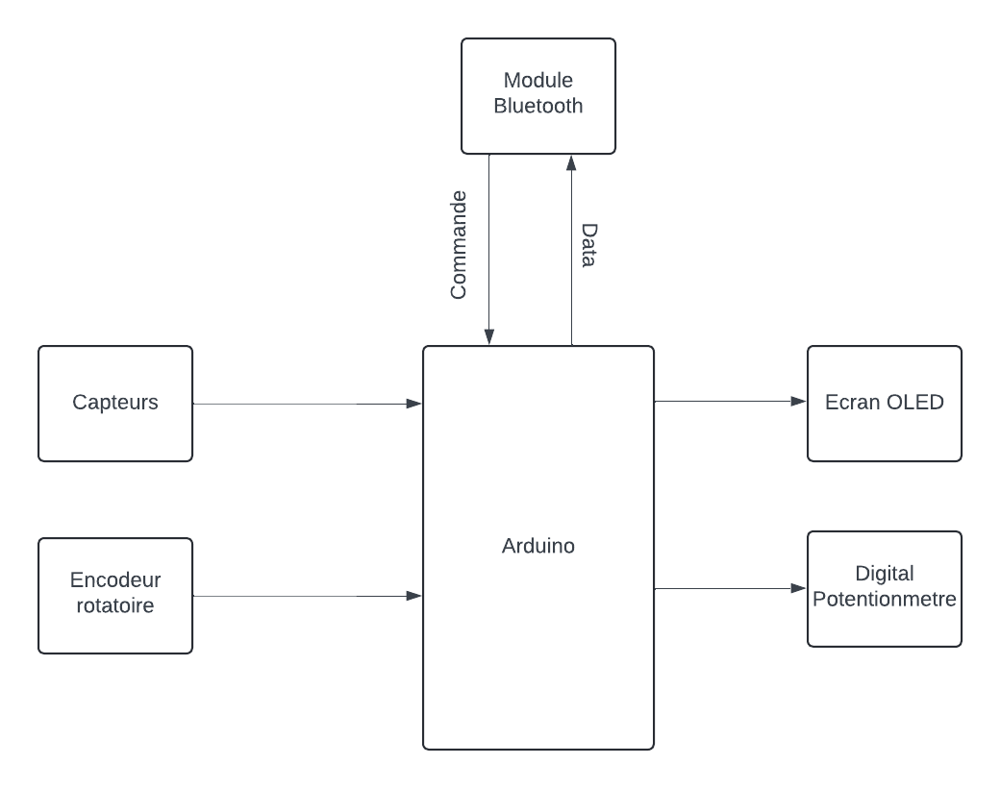

 # 6. KiCad:
 ## Réalisation de la Schématique de Shield
Dans cette étape de réalisation de la schématique du shield, notre objectif principal était de concevoir un circuit électronique fonctionnel pour notre projet. Nous avons choisi le logiciel KiCad comme plateforme de conception et nous nous sommes basés sur le modèle d'une carte Arduino Uno pour assurer la compatibilité. Après avoir identifié tous les composants nécessaires pour notre projet, nous avons ensuite procédé à la création de notre propre bibliothèque d'empreintes personnalisées pour les composants manquants. Cette démarche nous a permis d'adapter notre conception à nos besoins spécifiques et d'assurer une intégration optimale des composants dans notre schéma électrique.
Voici les symboles et empreintes des composants que nous avons créés dans le logiciel KiCad :

### **Module Bluetooth (HC-05)**
  
        

### **Encodeur rotatif (KY-040)**

           

### **Écran OLED**
  
             

### **Flex Sensor**
  
               

###  **Potentiomètre digital MCP-41050**

                 

Après avoir créé les schémas et les empreintes pour chaque composant, nous avons assemblé le schéma électrique complet du shield Arduino en reliant les broches des composants avec celles de la carte Arduino.

   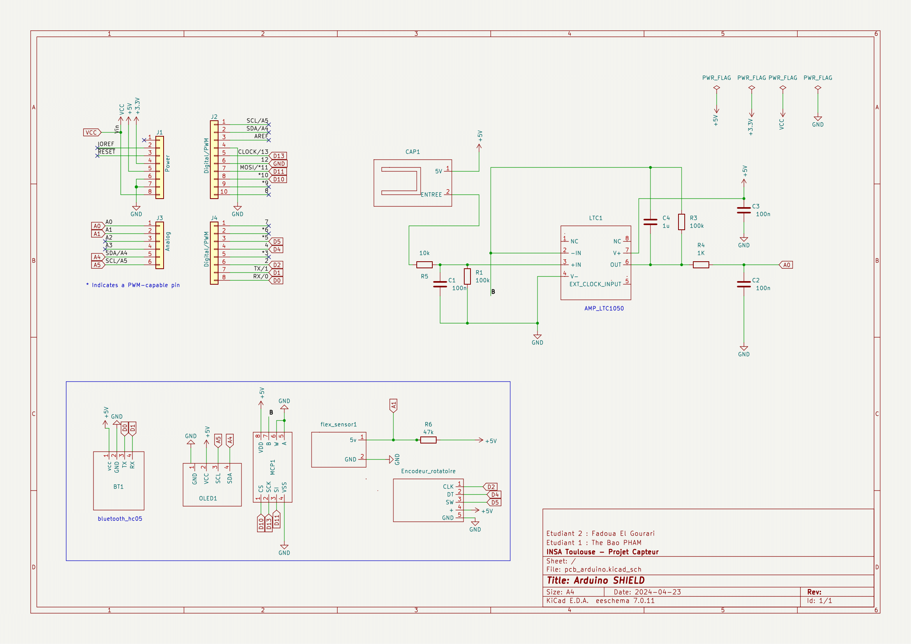
   
### Réalisation de la Schématique du PCB et visualisation 3D
Dans cette étape, nous avons réalisé le routage de notre circuit en intégrant les composants sur le PCB, tout en veillant à limiter les distances entre les composants et leurs pins, conformément aux directives de nos enseignants référents, M. Jérémie Grisolia et Mme Catherine Crouzet. Nous avons respecté des paramètres spécifiques tels que la largeur des pistes, la largeur d'isolation des pistes et les dimensions des trous pour chaque composant, afin d'assurer la conformité de notre conception. Une fois cette phase terminée, nous avons ajouté le plan de masse pour relier les pistes au GND.

Les paramètres spécifiques suivants ont été respectés :
* Taille du trou de perçage pour l'écran OLED,Flex Sensor,le module Bluetooth et l'encodeur rotatoire, l'AOP et le potentiomètre digital = 1mm
* Taille du trou de perçage pour les résistances et les capacités = 0.8 mm
* Dimensions du trou pour le support de l'AOP ,l'écran OLED,Flex Sensor,le module Bluetooth et l'encodeur rotatoire,le potentiomètre digital (pad n°1 rectangulaire et les autres pins sont ovales) = 2 mm * 2.5 mm
* Largeur d'isolation des pistes = 0.8 mm
* Taille du trou de perçage du via = 0.8 mm
   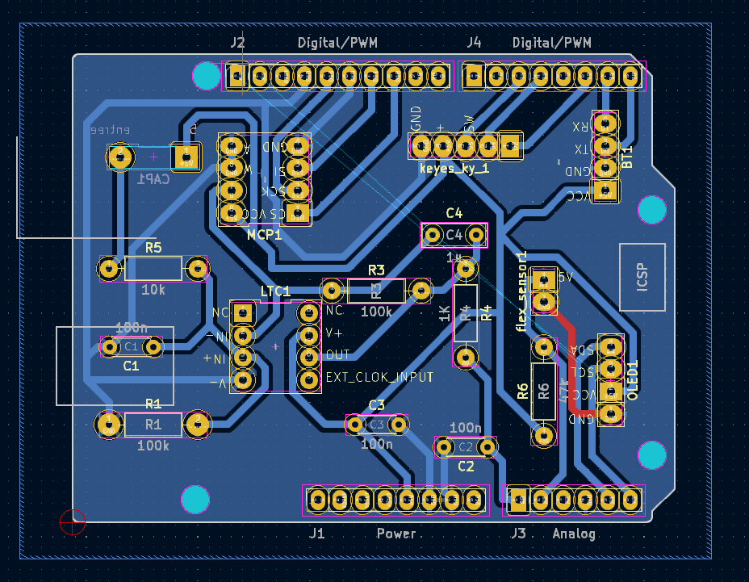

### **Visualisation 3D**
  
Après avoir réalisé le PCB, le téléchargement des modèles de composants sur le site "grabcad.com", qui n'étaient pas fournis par KiCad, s'est avéré très utile. Cela nous a permis d'obtenir un modèle 3D de notre PCB final. Nous avons ainsi pu vérifier que les positions des composants étaient correctes avant de passer à l'étape de l'impression du circuit.
  
  
  
### **Fabrication du shield PCB:**
  
Dans le cadre de notre projet, nous avons fabriqué un circuit imprimé (PCB) au sein des départements de Génie Électrique et Informatique et de Génie Physique de l'INSA Toulouse. La fabrication a commencé par la modélisation du circuit sur le logiciel KICAD, suivie de l'impression de cette modélisation sur du papier calque. Nous avons ensuite réalisé une insolation UV de notre plaquette d’époxy recouverte d’une fine couche de cuivre (environ 60 µm) pendant une dizaine de minutes, en utilisant le calque comme masque. La résine non exposée aux UV a été retirée avec un révélateur, puis la plaquette a été plongée dans un bain de perchlorure de fer pendant environ 7 à 9 minutes. Cette étape a permis de dissoudre le cuivre non protégé et de révéler les pistes du circuit. Enfin, un rinçage à l'acétone a été effectué pour éliminer les dernières traces de résine, nous permettant ainsi d'obtenir notre PCB conforme à la modélisation initiale. Cette réalisation a été possible grâce à l'aide précieuse de Cathy, assurant la qualité et la précision du produit final.

### Assemblage des composantes :
Une fois le PCB fabriqué, nous avons procédé à l'assemblage des composants, ce qui implique le perçage du PCB et la soudure des éléments électroniques. Conformément aux spécifications de notre projet, deux tailles de trous ont été prévues dans la conception sur KICAD : des trous de 0,8 mm de diamètre pour les composants tels que les amplificateurs opérationnels (AOP) LTC1050, les résistances et les capacités, et des trous de 1 mm de diamètre pour les broches de connexion de la carte Arduino Uno et les headers des différents modules (OLED, Bluetooth, encodeur rotatif...). À l'aide d'une perceuse électrique, nous avons percé le PCB aux emplacements désignés pour insérer les composants. Ensuite, nous avons soudé les composants en place en utilisant de l'étain pour assurer des connexions électriques solides et fiables. Ce processus d'assemblage a permis d'obtenir un shield opérationnel, prêt à être intégré dans notre système.

 # 7. Application mobile:
Pour ce projet, nous avons développé une application mobile sur MIT App Inventor qui se connecte au module Bluetooth du capteur. Cette application dispose d'une interface unique permettant d'acquérir les données du capteur en temps réel, de les visualiser sur un graphique dynamique et de enregistrer le graphique dans notre téléphone ainsi que de régler le gain de l'amplificateur.

# Initilisation de programme:
<h3>Au début, nous avons déclaré les variable globale utilisé dans le programme de l'application

 

Initialiser le programme 

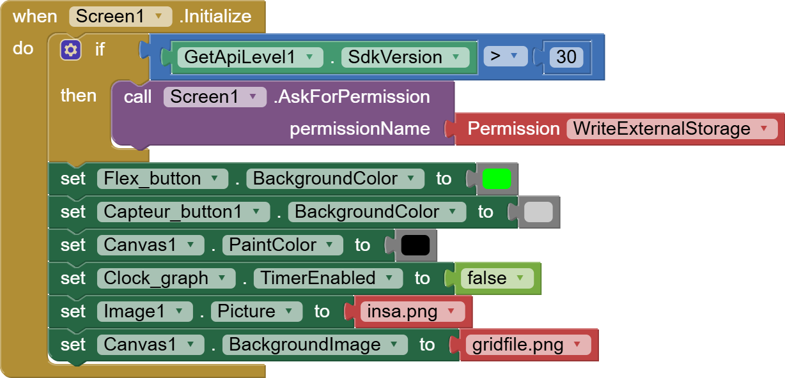

# Composantes dans l'interface:
## "Connect Device" 

Ce bouton est utilisé pour choisir la module bluetooth qu'on veut le connecter

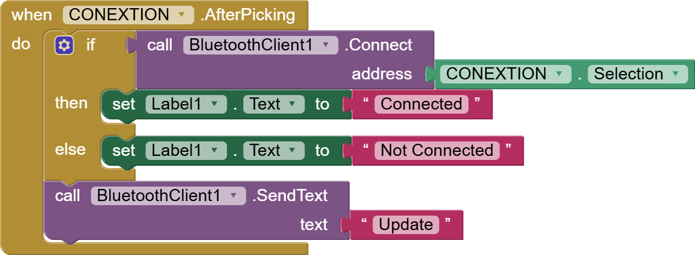

## Statut de connexion bluetooth:
Étiquette représentant la statut de connexion Bluetooth. 

## "Disconnect" 
 Ce bouton est utilisé pour déconnecter la bluetooth.

## Zone graphique
 
On a utilisé la composante "Canvas" dans MIT pour visualiser le signal

Dans cette zone, le signal de tension mesuré est visualisé en fonction du temps. Chaque fois que le potentiel est mesuré, il est représenté par un point sur le graphique.

Concernant le fond du graphique, il est représenté en échelle linéaire. Chaque petit carré correspond à 500 ms en horizontale et à 0,25 V en verticale.

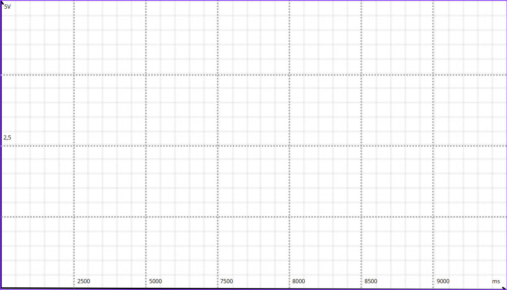
Figure 3: Le fond de la graphique

## Statut "Overload"

Parce que, l'Arduino ne mesure que jusqu'à 5V. En outre, avec un gain variable d'ampificatuer, la tension mesurée peut facilement devenir saturée. Ce phénomètre peut être observé lorsque le signal est visualisé dans la graphique. Pourtant, si on prendla valeur de résistance en seul fois, la saturation causerait un mal calcul de la résistance de capteur

Dans notre programme d'Arduino, nous avons défini une limitation de tension mesurée pour éviter la sarturation. La limitation de tension est 0 - 4.8V. Pour pouvoir détecter la saturation, une fois que la tension mesurée dépasse cette limite, l'Arduino vas envoyer un message qui contient une chaine des charactères "over". Si la message recus contien ce mot, l'étiquette "Overload" devient rouge; sinon, elle reste verte.

## "Start"
Lancer l'acquitiion de tension continue avec le délai entre deux acquisitions est 100ms

Une fois ce bouton est appuyé, il désactivera les boutons restants pour éviter d'être pressé par erreur et d'affecter l'acquisition. Pour arrêter l'acquisition, appuyez une nouvelle fois sur ce bouton.

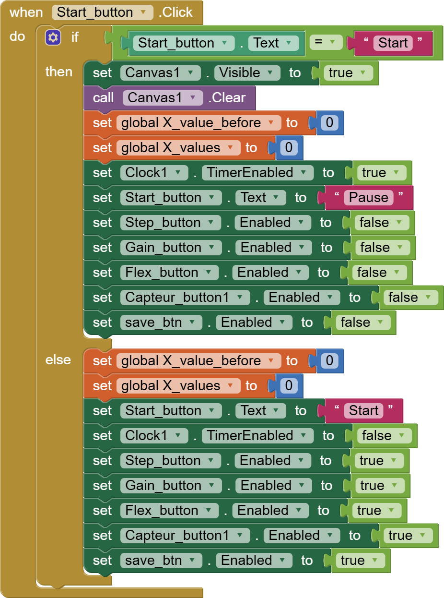

Pour pouvoir récupérer automatiquement des données, nous commandons séquentiellement Arduino de nous evoyer les données. Pour cela, nous avons utilisé le composante "Clock"dans MIT

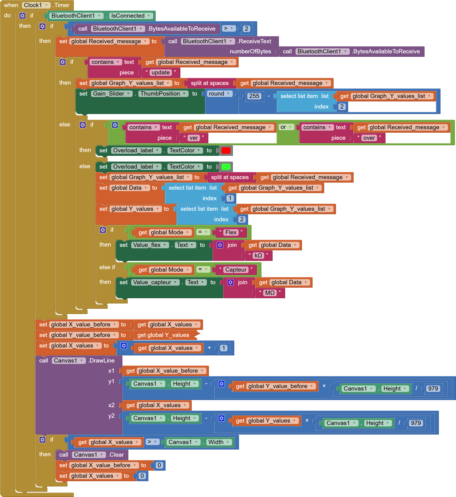

## "Step"

## "Save graph"
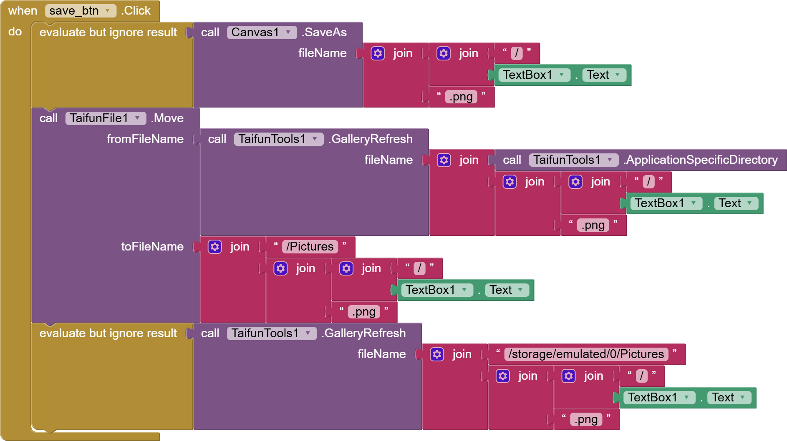

## "Flex sensor" et "Graphite"
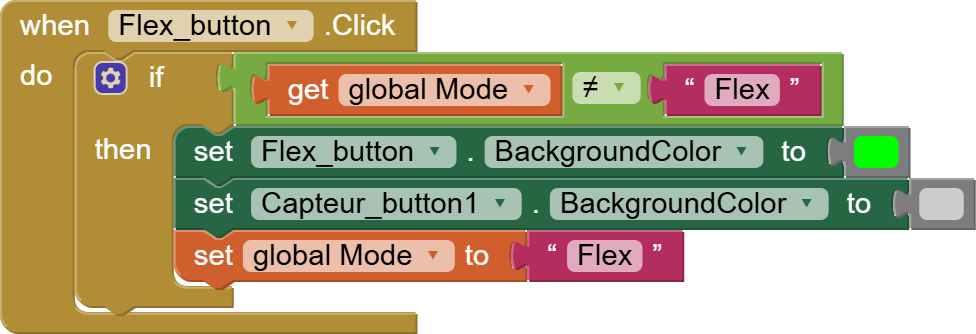
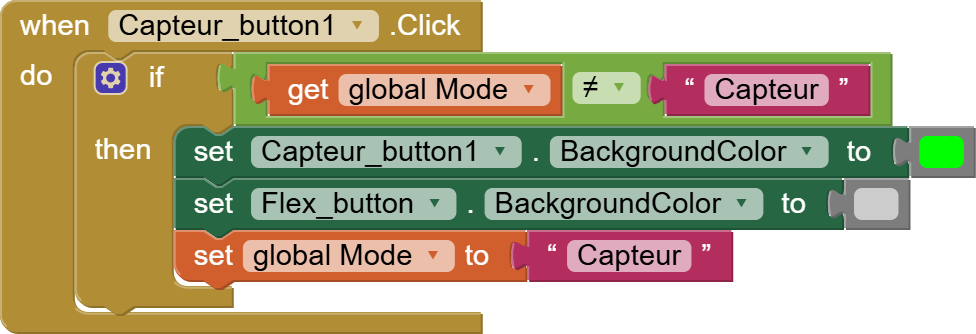

## "Gain" Slider
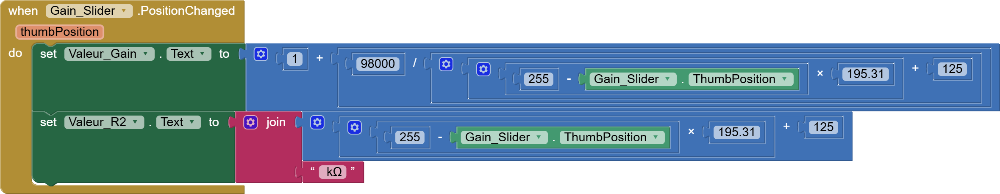

## "Change gain"

## "Resistance Potentiometre"

## "File Name" 

 
 # 8. Mesures et résultats :
 
Pour étudier les caractéristiques du capteur, nous avons utilisé un banc d'essai composé de sept demi-cylindres disposés de manière séquentielle, du plus petit au plus grand. Le diamètre de chaque demi-cylindre variait de 2 cm à 5 cm, avec un pas de 0,5 cm.

 

Notre objectif était d'analyser la résistance du capteur en fonction de sa déformation induite en le pliant sur ces cylindres. Le degré de déformation a été calculé à l'aide de la formule  
 
      𝜀 = 𝑒 / (2r) 

Où **𝜀** représente la déformation, **e** désigne l'épaisseur de la feuille de papier, et **r** représente le rayon de chaque demi-cylindre. Pour l'épaisseur **e**, nous avons choisi une valeur de 0,16 mm, correspondant au grammage d'une feuille avec une densité de 140 g/m². 

Notre expérimentation a consisté à mesurer la déformation des capteurs sous compression et sous tension afin d'évaluer de manière exhaustive leurs caractéristiques de performance.
 
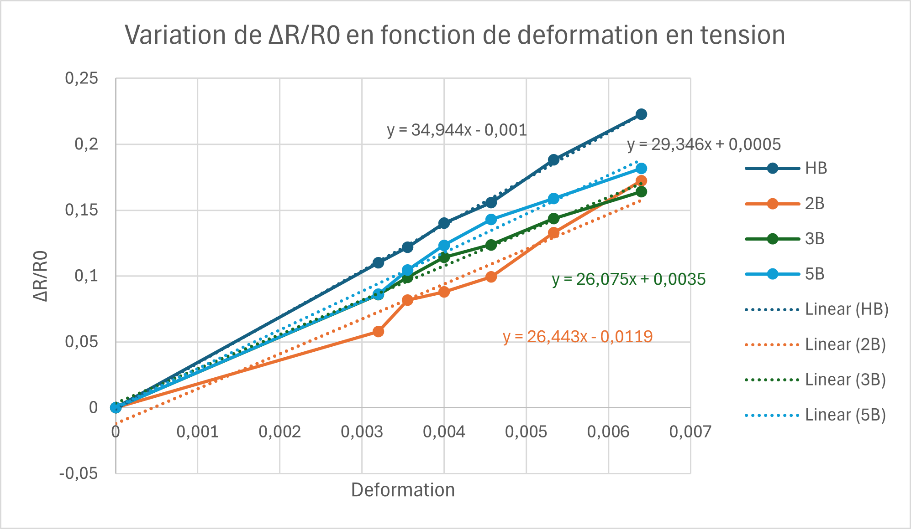

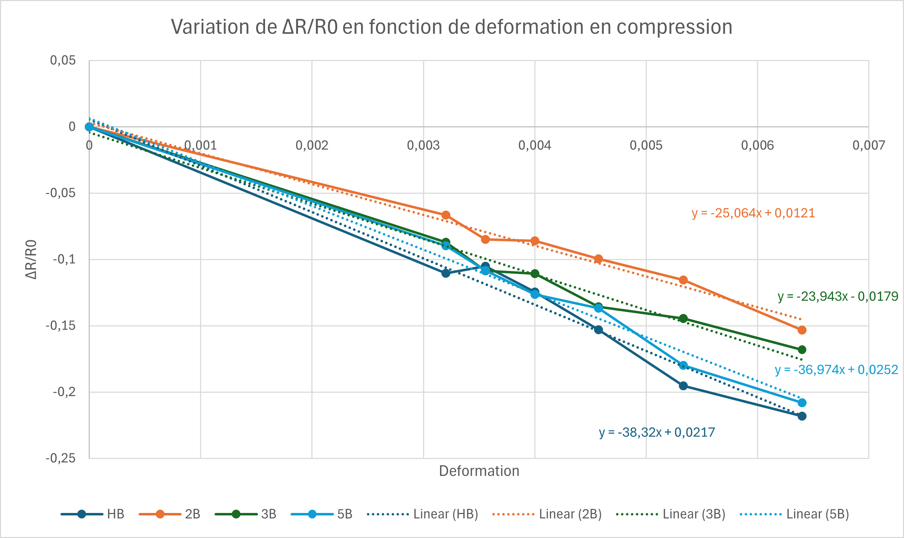

